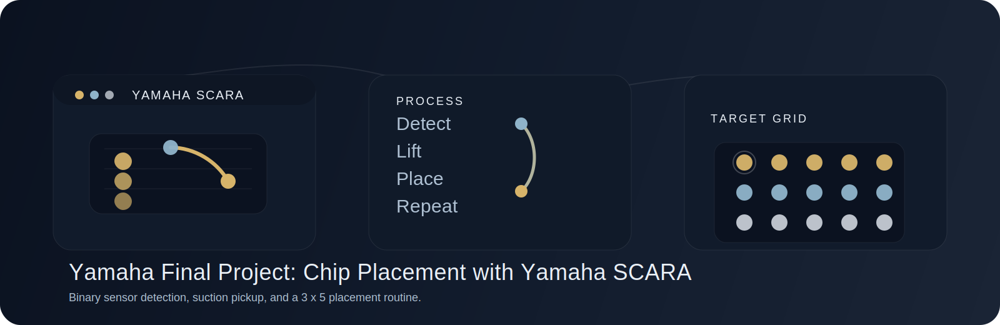
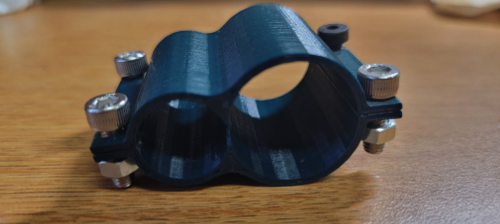
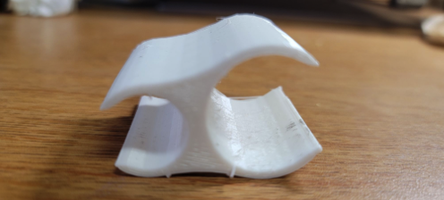
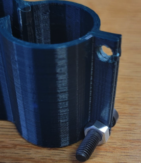

# Yamaha Final Project: Chip Placement with Yamaha SCARA

	

	

A Yamaha SCARA robot programmed to pick up 15 poker chips from two source stacks and place them into a precise 3 x 5 flat pattern using suction and a binary inductive proximity sensor.

	<a href="#hardware"><strong>Hardware</strong></a> · <a href="#software"><strong>Software</strong></a> · <a href="#media"><strong>Media</strong></a>

## Project at a Glance

<table>
	<tr>
		<td width="58%" valign="top">
			<table>
				<tr><th align="left">Item</th><th align="left">Details</th></tr>
				<tr><td>Course</td><td>MFET 248</td></tr>
				<tr><td>Team</td><td>Adyaa Khera, Gabriella Thalos</td></tr>
				<tr><td>Lab Section</td><td>Thursday 11:30-1:20pm</td></tr>
				<tr><td>Robot</td><td>Yamaha SCARA</td></tr>
				<tr><td>Controller</td><td>RCX Studio / RCX 340</td></tr>
				<tr><td>Task</td><td>Pick and place 15 chips into a 3 x 5 grid</td></tr>
				<tr><td>Source Stacks</td><td>Two stacks: 10 chips and 5 chips</td></tr>
				<tr><td>Placement Points</td><td>15 target points</td></tr>
				<tr><td>Sensing</td><td>Binary inductive proximity sensor with reflective tape on each chip</td></tr>
				<tr><td>I/O</td><td>Suction control and status indicator lights</td></tr>
				<tr><td>End Effector</td><td>Suction pickup with custom sensor holder</td></tr>
				<tr><td>Programming Mode</td><td>Offline point teaching in POWER mode with servos off</td></tr>
				<tr><td>Execution Logic</td><td>Two WHILE loops with GETCHIP subroutines and SELECT/CASE placement</td></tr>
				<tr><td>Timeline</td><td>Two-week development window</td></tr>
			</table>
		</td>
		<td width="42%" valign="top" align="center">
			
			 
			<em>Working demonstration</em>
		</td>
	</tr>
</table>

## Project Overview

This project combined robot calibration, sensor-based detection, end-of-arm tooling design, and RCX 340 programming to complete a reliable pick-and-place routine within a two-week timeline. Because the chips were plastic and non-metallic, a reflective metallic tape was applied to each chip so the inductive sensor could detect them consistently.

The robot was programmed to:

- Start from a home position
- Detect chip presence using a binary inductive sensor
- Adjust for chip height as the stacks changed
- Pick chips with suction
- Place each chip into a predefined 3 x 5 grid
- Signal the end of the program with indicator lights

## Hardware

### End-of-Arm Tooling

The robot used a suction end-effector for chip pickup. To keep the sensor aligned with the arm and reduce interference with the chip stacks, a custom proximity sensor holder was designed in Siemens NX and 3D printed.

Two designs were explored:

<table>
	<tr>
		<td align="center" width="50%">
			 
			<strong>2-piece PLA holder</strong>
		</td>
		<td align="center" width="50%">
			 
			<strong>Snap-fit TPU holder</strong>
		</td>
	</tr>
</table>

The 2-piece PLA holder used M5 screws and nuts for a rigid mount. The 1-piece TPU snap-fit holder was intended to reduce fasteners, but it was too flexible to keep the sensor upright once the tubing and cable load was applied. The 2-piece PLA design was ultimately used because it was more rigid and better suited for fast, repeatable motion.

### Sensors, I/O, and Indicators

- Binary inductive proximity sensor: detected whether a chip was present at the sensing location
- Reflective metallic tape: added to the top of each chip so the sensor could detect it
- Digital output for suction: activated and released the end-effector
- Indicator light output: used to show program start and completion

### Mechanical Considerations

The holder design had to account for:

- Sensor operating range
- End-effector and arm clearance
- Fastener size and spacing
- PLA and TPU material behavior
- Risk of contact between the sensor, tubing, and chip stacks

## Software

The robot program was written in RCX Studio / RCX 340 and organized around taught points and conditional logic.

### Programming Approach

The workflow used a combination of:

- Pre-taught robot points for home, stack locations, and all 15 placement targets
- A dynamic chip-height reference updated during execution
- `WHILE` loops to process the two chip stacks
- `SELECT` / `CASE` logic to move each chip to its correct location
- `WHERE` and `LOC3` commands to capture the current chip height after detection
- `DRIVE` commands to lower the arm until the sensor detected a chip
- Digital outputs to control suction and program status lights

### Program Logic

1. The robot starts at home and turns on a light to indicate the program has begun.
2. It moves to the 5-chip stack and lowers the arm until the proximity sensor detects a chip.
3. Once a chip is detected, the program records the current height, engages suction, lifts the chip, and places it at the next target position in the grid.
4. The same process repeats for the remaining four chips in the first stack.
5. The robot then moves to the 10-chip stack and repeats the process for the remaining 10 chips.
6. When all 15 chips have been placed, the completion light turns on and the robot halts.

### What Made the Program Work

The most important part of the software was using the binary sensor as a trigger rather than trying to measure a precise distance. That forced the program to be responsive and state-based: detect, lift, grasp, move, and place. The result was a robust routine that matched the limits of the hardware and the available sensor.

## What We Learned

This project taught us how to:

- Calibrate a robot for a specific workcell
- Ground-level a task so a binary sensor could detect the top chip reliably
- Work with inductive proximity sensing instead of analog distance feedback
- Design end-of-arm hardware that balances rigidity, clearance, and ease of assembly
- Structure a robot program around taught positions, loops, and conditional branching

## Future Improvements

If we were to continue improving the project, we would focus on three main areas.

### Sensor Holder

The final holder was mechanically strong, but alignment was tedious because the sensor and end-effector needed to stay level. A future revision could include a built-in shelf or better adjustment geometry so the sensor can be mounted more easily without so many fasteners. The mounting tabs could also be made thicker to reduce cracking around the screw holes.

### Chip Surface

The artificial ground surface allowed the robot to reach the chips, but it was slippery and sometimes caused chips to tip or shift when a neighboring chip was removed. A more stable surface or a raised worktable would improve repeatability.

### Program Efficiency

The current program is functional, but it relies on manual point selection for all 15 destinations. A more parametric version would reduce repetition and make the program easier to scale if the pattern changed or if more chips needed to be placed.

<table align="center">
	<tr>
		<td width="50%" align="center">
			 
			<em>Tab cracking defect</em>
		</td>
		<td width="50%" align="center">
			 
			<em>Surface slipping defect</em>
		</td>
	</tr>
</table>

---

<em>Developed as the final project for MFET 248.</em>
